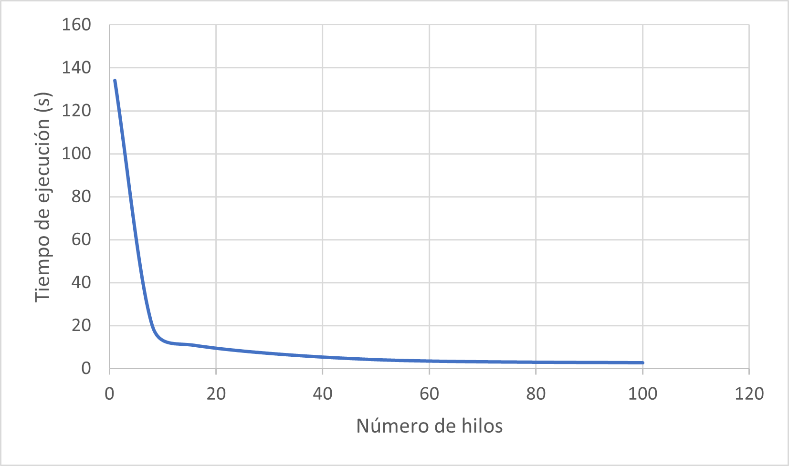
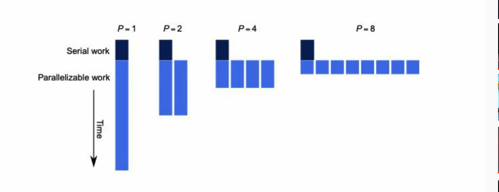

## **Escuela Colombiana de Ingeniería**
## **Arquitecturas de Software - ARSW**
#### Ejercicio Introducción al paralelismo - Hilos - Caso BlackListSearch

### Integrantes:

|     Nombre    |     Git         |
|--------------|------------- | 
| Camilo Rincón|[Rincon10](https://github.com/Rincon10 )  |
|Galeano Garzón |[Ersocaut](https://github.com/Ersocaut)   |

#### **Parte I - Introducción a Hilos en Java**

1. De acuerdo con lo revisado en las lecturas, complete las clases CountThread, para que las mismas definan el ciclo de vida de un hilo que imprima por pantalla los números entre A y B.
    * Se completo la clase <b>CountThread</b> de tal manera que la clase tenga como atributos el limite superior e inferior del intervalo a imprimir, además de esto la clase debe heredar de la clase <i><b>Thread</b></i>.


2. Complete el método __main__ de la clase CountMainThreads para que:

	- Cree 3 hilos de tipo CountThread, asignándole al primero el intervalo [0..99], al segundo [99..199], y al tercero [200..299].
        * Creacion de los tres hilos
        
    
            	
	- Inicie los tres hilos con 'start()'.
	
	- Ejecute y revise la salida por pantalla: 
	    - Para la ejecución del programa se utilizo la siguiente linea de comandos:
	    ```
	    mvn package -U
	    mvn exec:java -Dexec.mainClass="edu.eci.arsw.threads.CountThreadsMain"
	    ```
	
	La ejecución de los hilos realizando <b>.start()<b/> resulta en una salida de números desordenada.
	
	

	- Cambie el incio con 'start()' por 'run()'.¿Cómo cambia la salida?¿Por qué?: 
	
	La salida cambia completamente, pues al iniciarse un Thread con start() sí se genera un hilo como tal, mientras que al hacerlo con run() únicamente se llama a ese método, no se inicia un hilo como tal.
	
	
	
	**Al iniciarse con start():** <br> 
	Inicia un Thread1 y su tarea, en los pocos milisegundos se inicia también el Thread2, asímismo el Thread3, lo que hace que los 3 esten funcionando al mismo tiempo, generando el cambio en la salida, esto se debe a que se esta creando un nuevo hilo, este se vuelve ejecutable y comienza su vida.
	
	**Al llamarse el método run():** <br>
	se ejecuta Thread1.run() se espera a que termina, llama a Thread2.run() este termina y finalmente llama a Thread3.run(), esto a que no se esta creando directamente un hilo.
	
	
#### **Parte II - Ejercicio Black List Search**

Como se puede observar se modificó el código de tal forma que fueran los threads los cuales revisaran en un rango específico de las diferentes listas negras, para esto se creó una nueva clase llamada <b><i>BlackListThread</i></b>.

##### Clase Thread


##### Metodo Check
En este metodo se utiliza la solucion "divide y venceras", esto ya que se esta haciendo que no sea el metodo el que revise todas las listas existentes, si no que sean los threads los que revisen de manera concurrente diferentes rangos de todas las listas negras. 


##### Probando el metodo Check

* Se sabe que el HOST 202.24.34.55 está reportado en listas negras de una forma más dispersa, y que el host 212.24.24.55 NO está en ninguna lista negra.

##### Direccion 202.24.34.55 (reportada)


##### Direccion 212.24.24.55 (NO reportada)


#### **Parte II.I Discusión**
<p style="text-align:justify">
La estrategia de paralelismo antes implementada es ineficiente en ciertos casos, pues la búsqueda se sigue realizando aún cuando los N hilos (en su conjunto) ya hayan encontrado el número mínimo de ocurrencias requeridas para reportar al servidor como malicioso. Cómo se podría modificar la implementación para minimizar el número de consultas en estos casos?, qué elemento nuevo traería esto al problema?
</p>

<p style="text-align:justify">
Para evitar que se sigan realizando validaciones de manera innecesaria se podría colocar una variable común (global) entre los threads, ya que esta permitiría que todos los threads sepan y puedan verificar dicha variable y parar cuando se encuentre el número mínimo de ocurrencias requeridas para reportar al servidor como malicioso, claramente no es tan sencillo, ya que para que esta nueva idea funcione se debe garantizar siempre <b>la exclusión mutua</b> la cual dice que se puede usar un recurso por un thread a la vez, cuando el recurso es solicitado de forma simultánea por varios threads este debe ser concedido a uno de ellos en un tiempo finito y liberarlo para que el siguiente en la fila lo tome.
</p>>

       

#### **Parte III - Evaluación de Desempeño**

* Para la ejecución del programa se utilizo la siguiente linea de comandos:
	```
	mvn package -U
        mvn exec:java -Dexec.mainClass="edu.eci.arsw.blacklistvalidator.Main"
        ```

1.    1 solo hilo.


<br>


2.    Tantos hilos como núcleos de procesamiento (haga que el programa determine esto haciendo uso del [API Runtime](https://docs.oracle.com/javase/7/docs/api/java/lang/Runtime.html).
	
En este caso para saber cuantos nucleos de procesamiento tenemos usaremos la clase Runtime y con el metodo <i> <b> availableProcessors() </i> </b> sabremos el numero de nucleos de procesamiento que hay disponible en la maquina virtual de java  
    

<br>    
 <br>
<br>
    8 hilos                                                                                                             
<br>
<div id="hilos">
</div>


<br> 


    
3.    Tantos hilos como el doble de núcleos de procesamiento, 16 hilos.
	

<br>


4.    50 hilos.


<br>


5.    100 hilos.


<br>


Con lo anterior, y con los tiempos de ejecución dados, haga una gráfica de tiempo de solución vs. número de hilos. 

 <br>

Analice y plantee hipótesis con su compañero para las siguientes preguntas (puede tener en cuenta lo reportado por jVisualVM):

#### **Parte IV - Ejercicio Black List Search**


1. Según la [ley de Amdahls](https://www.pugetsystems.com/labs/articles/Estimating-CPU-Performance-using-Amdahls-Law-619/#WhatisAmdahlsLaw?):

	 <br>
	
	Donde _S(n)_ es el mejoramiento teórico del desempeño, _P_ la fracción paralelizable del algoritmo, y _n_ el número de hilos, a mayor _n_, mayor debería ser dicha mejora. 
	
	#### 200 Hilos-1.949s
	
	#### 500 Hilos-s
	
	
	* ¿Por qué el mejor desempeño no se logra con los 500 hilos?
	    A pesar que en la teoria se espere que el desempeño mejore a mayor cantidad de hilos, en la practica esto no ocurre siempre ya que todos los hilos estan haciendo uso de un recurso compartido (procesador) lo cual significa que cada uno de estos debera esperar su turno para poder utilizarlo y asi garantizar la exclusión mutua, en la imagen a continuacion se ejemplifica lo antes mencionado.
	 
	 <br>
	       
	* ¿Cómo se compara este desempeño cuando se usan 200?. 
       El desempeño es mejor porque el tiempo de espera por el recurso compartido es menor.  
       
2. Cómo se comporta la solución usando tantos hilos de procesamiento como núcleos comparado con el resultado de usar el doble de éste?.

    * Como se observa en las imagenes <a href="#hilos">Imagenes</a> el desempeño no se ve afectado cuando la cantidad de hilos no es muy alta, incluso este mejora cuando se usan 16 hilos en vez de 8 hilos.  


3. De acuerdo con lo anterior, si para este problema en lugar de 100 hilos en una sola CPU se pudiera usar 1 hilo en cada una de 100 máquinas hipotéticas, la ley de Amdahls se aplicaría mejor?. Si en lugar de esto se usaran c hilos en 100/c máquinas distribuidas (siendo c es el número de núcleos de dichas máquinas), se mejoraría?. Explique su respuesta.

    * Claramente mejoraria ya que a medida que se pueda involucrar más procesadores (En este caso se puede decir que cada maquina hipotetica posee su procesador), el trabajo paralelizable va a disminuir ya que no existiran sub-procesos compitiendo y esperando por el recurso a utilizar el cual seria el procesador.
